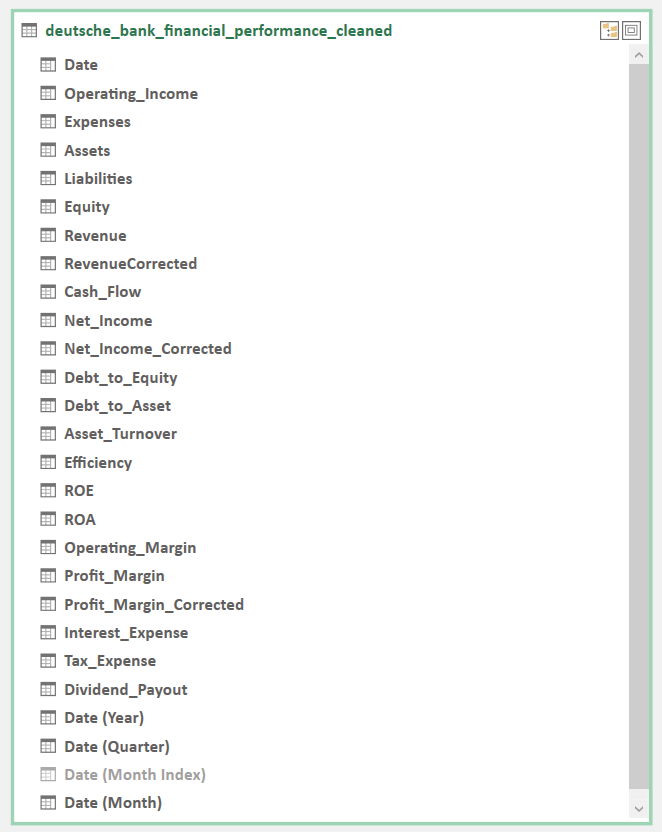
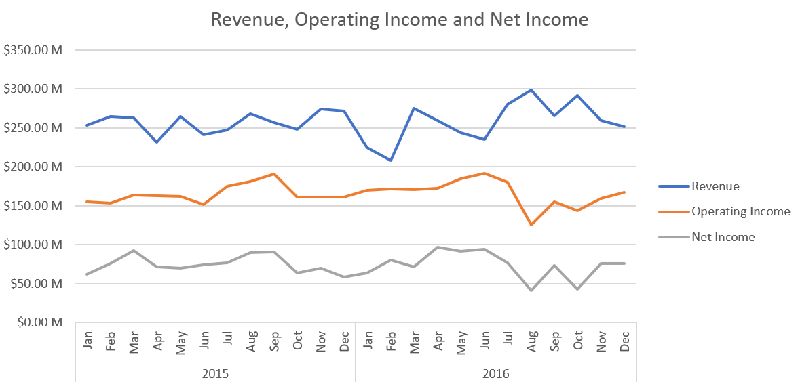
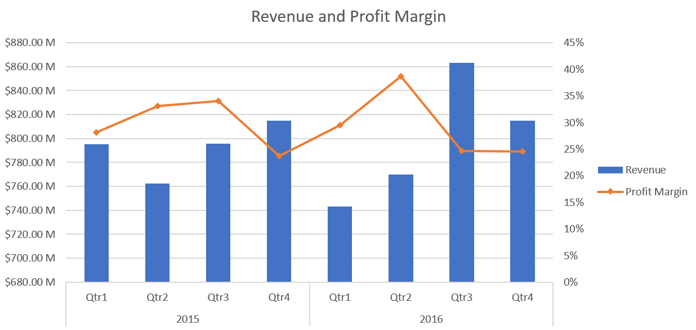
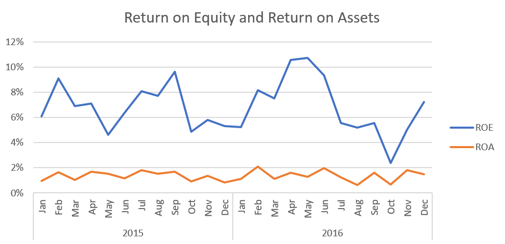
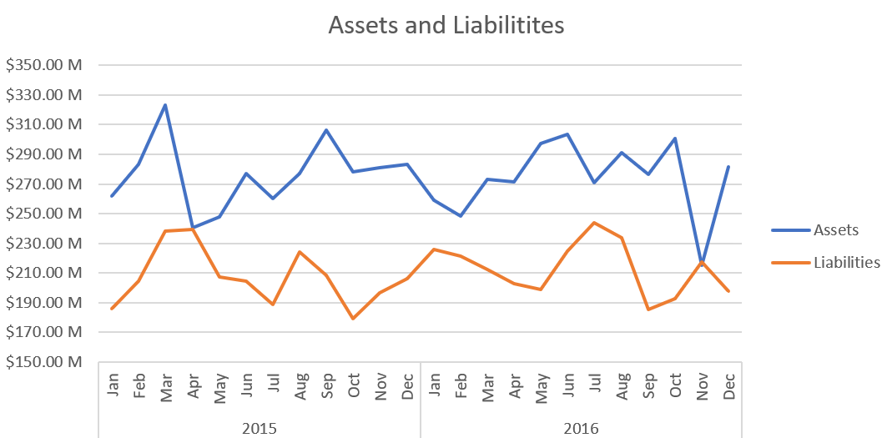
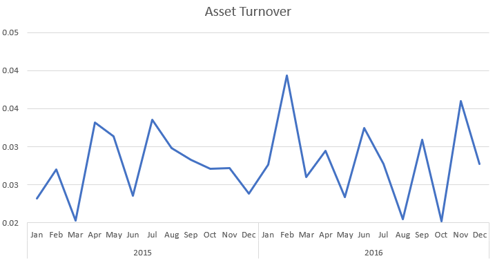
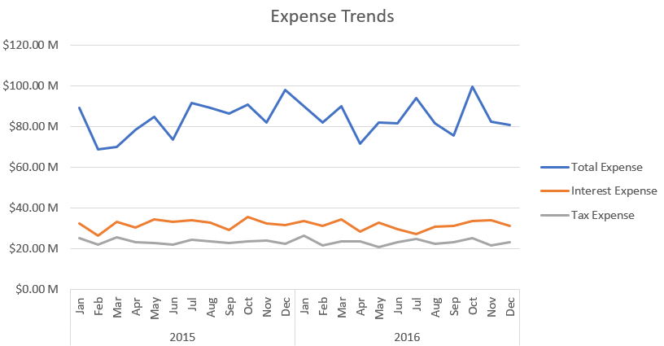
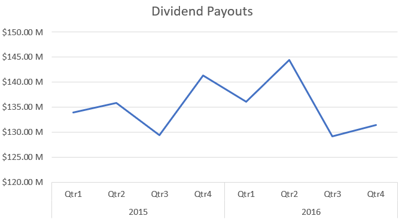
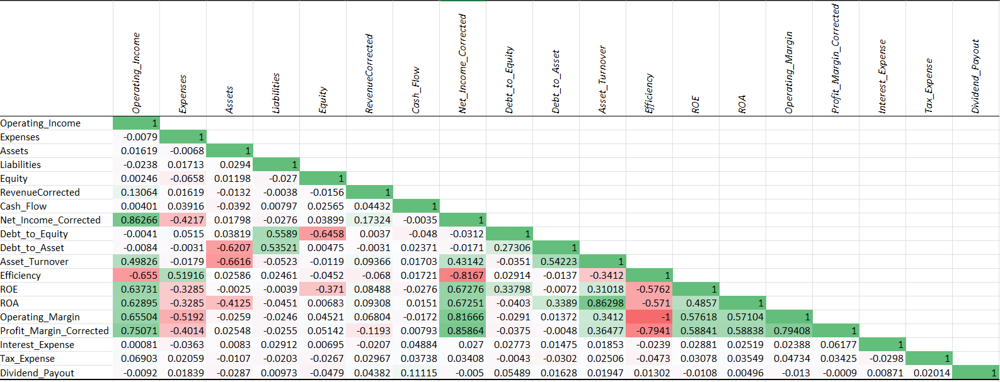

# Deutsche Bank Financial Performance 2015-2016

Deutsche Bank AG is a leading German multinational investment bank and financial services company, headquartered in Frankfurt, Germany, with dual listings on the Frankfurt Stock Exchange and the New York Stock Exchange. They provide a comprehensive range of financial services, including investment banking, corporate banking, asset management, and retail banking.

This report provides a detailed trend analysis of Deutsche Bank's financial performance, focusing on revenue growth, profitability trends, and expense dynamics for the years 2015 and 2016.

## Table of Contents
1. [Overview](#overview)  
2. [Data Model](#data-model)  
3. [Insights Deep-Dive](#insights-deep-dive)  
   - [Revenue and Income Trends](#revenue-and-income-trends)  
   - [Profit Trends](#profit-trends)  
     - [Profit Margin](#profit-margin)  
     - [Profitability Ratios](#profitability-ratios)  
   - [Assets and Liabilities](#assets-and-liabilities)  
     - [Declining Assets and Growing Liabilities](#declining-assets-and-growing-liabilities)  
     - [Assets Turnover](#assets-turnover)  
   - [Expense Trends](#expense-trends)  
   - [Dividend Payouts](#dividend-payouts)  
   - [Correlation](#correlation)  
4. [Takeaway](#takeaway)  
   - [Stable Revenue with Modest Growth](#stable-revenue-with-modest-growth)  
   - [Profitability Fluctuations](#profitability-fluctuations)  
   - [Asset and Liability Dynamics](#asset-and-liability-dynamics)  
   - [Expense Patterns](#expense-patterns)  
   - [Dividend Payout Trends](#dividend-payout-trends)  

## Overview
From 2015 to 2016, the company’s financials show a picture of modest revenue growth paired with increasing leverage and slightly eroding profitability. Revenue and Operating income both rose by 1%, yet net income and cash flow both declined by 1%. This small dip in net income despite revenue growth indicates rising costs or additional expenses (such as interest or taxes) that are offsetting the incremental gains in revenue.
Meanwhile, the total assets contracted by 1%, while liabilities grew by 3%, leading to an increase in both the debt-to-equity (up 6%) and debt-to-asset (up 10%) ratios.The Return on equity (ROE) and Return on assets (ROA) remained flat, which implies the company’s overall efficiency in generating returns did not improve despite higher liabilities and a marginally lower asset base.A small reduction in tax expense (down 2%) may be related to shifts in the company’s effective tax rate or timing of certain tax items.

## Data Model

- **Date** – The date corresponding to each financial record (from January 2015 onwards).  

- **Operating_Income** – The income generated from the bank's core business operations.  

- **Expenses** – The total costs incurred during operations.  

- **Net_Income** – The profit after subtracting expenses from operating income.  

- **Assets** – The total assets owned by the bank, including cash, investments, and other resources.  

- **Liabilities** – The total debts and financial obligations owed by the bank.  

- **Equity** – Shareholders' equity, representing the net value of assets after deducting liabilities.

- **Operating_Margin** – A financial metric that measures the percentage of revenue that remains after covering operating expenses.

- **Debt_to_Equity** – A financial ratio measuring the proportion of debt relative to equity.

- **Debt_to_Asset** – A financial ratio measuring the proportion of debt relative to asset. 

- **ROA (Return on Assets)** – A profitability metric calculated as net income divided by total assets.

- **ROE (Return on Equity)** – A profitability metric calculated as net income divided by total equity.   

- **Revenue** – The total income generated from all operations and business activities.  

- **Cash_Flow** – The net cash inflow or outflow from operating activities.  

- **Profit_Margin** – A ratio indicating the percentage of revenue that remains as profit after expenses.

- **Asset_Turnover** – A financial ratio that measures how efficiently a company uses its assets to generate revenue.

- **Interest_Expense** – The cost incurred on borrowings and other debt obligations.  

- **Tax_Expense** – The amount paid as taxes on the company's profits.  

- **Dividend_Payout** – The portion of earnings distributed to shareholders in the form of dividends.  

## Insights Deep-Dive

### Revenue and Income Trends

- Revenue fluctuates across both years but remains relatively stable. In 2015, revenue shows a slight upward trend with fluctuations. In 2016, revenue decreases at the start but recovers in the middle of the year before stabilizing.
- Operating income follows a similar pattern to revenue but with smaller fluctuations. Operating income is consistently positive, suggesting the company is generating profits from its core business operations. A dip in mid-2016 is observed, which could indicate increased operating expenses or lower sales.
-  Net Income is more volatile, suggesting additional external factors like taxes, interest expenses, or extraordinary costs affect final profits. The company remains profitable throughout both years, as net income is always positive.

### Profit Trends

#### Profit Margin

- Despite starting lower in Q1 2016 compared to Q1 2015, each subsequent quarter shows improvement. By Q4 2016, revenue matches (and slightly exceeds) Q4 2015.
- 2015’s margins decline steadily through the year. In contrast, 2016 starts off with a lower margin (Q1) but then surges in Q3 to 30%, which is the highest margin across both years. This spike may suggest a combination of cost reductions, pricing strategies, or one-time factors boosting profitability in that quarter.

#### Profitability Ratios

- Both years show monthly swings, with 2015 reaching an absolute peak of 12% ROE and 2016 peaking at 11%. The early months (January) are consistently the weakest in both years.
- ROA remains relatively steady between 1% and 3% in both 2015 and 2016, indicating that changes in net income have a more pronounced impact on equity returns than on total assets.
- Both years feature elevated ROE/ROA around late spring and summer (May through August). This may be because of seasonal influences or other business factors.

### Assets and Liabilities

#### Declining Assets and Growing Liabilities

- Assets consistently exceed Liabilities in both 2015 and 2016, suggesting positive net worth or equity. However, the declining peak of Assets from 2015 to 2016 might be worth looking into.
- In December of each year, Assets settle around $260M–$270M, while Liabilities settle around $210M in 2015 and near $200M in 2016. Despite mid-year ups and downs, the ending positions are relatively stable.

#### Assets Turnover

- Both years show the Asset Turnover ratio fluctuating within a fairly tight band of 0.02–0.04. This suggests that the company’s efficiency in generating revenue from its assets remains relatively stable.
- The ratio tends to peak around late spring/early summer (May–June) and again in late summer or early fall (August–October). These recurring spikes may point to seasonal sales cycles, product launches, or other operational factors that temporarily boost revenue relative to assets.

### Expense Trends

- Both years show swings, but 2015 has a more dramatic range (as low as $58M, as high as $93M) compared to 2016 (roughly $69M–$91M).
- Interest expense remains within a tight corridor (low $9M to high $9M range) in both years, suggesting consistent financing costs. Slight upticks (e.g., 2016 August at $9.72M) could indicate temporary spikes in borrowing or rate changes, but overall it’s stable.
- 2015 sees higher peaks (approaching $30M), while 2016’s tax expense tops out near $27–$28M. The overall range in 2016 is narrower, possibly reflecting steadier taxable income or tax strategies.

### Dividend Payouts

- Dividends show a steady, incremental rise each quarter—from roughly $134M in Q1 to $141M by Q4. The year ends at its highest payout, suggesting a consistent upward trend throughout 2015.
- After that peak in 2016 Q2, Q3 plunges to $129.11M — the lowest point of the two-year span and Q4 recovers only modestly to $131.37M.
- While 2015 shows consistent quarterly increases, 2016’s pattern is more erratic, suggesting the company may have revised its dividend strategy mid-year.

### Correlation

- Revenue, Operating Income, Net Income, and Cash Flow move together, indicating that as the business grows its top line, profitability and cash generation improve.
- Return metrics (ROA, ROE, Margins) also tend to cluster positively, reflecting that stronger operational performance lifts multiple measures of return.
- Debt Ratios vs. Profitability/Return indicate that higher leverage can weigh on returns if not managed effectively.
- Dividens tend to correlate positively with Net Income and Retained Earnings. Companies with higher earnings and sufficient retained earnings often have greater capacity to pay dividends.

## Takeaway
### Stable Revenue with Modest Growth
- Revenue remains relatively stable across both years, with a slight upward trend in 2015 and an initial dip followed by recovery in 2016.
- Despite revenue growth, net income and cash flow declined slightly, suggesting rising costs or additional expenses are offsetting top-line gains.

### Profitability Fluctuations
- Operating income remains positive and mirrors revenue trends, indicating healthy core business performance.
- Net income shows greater volatility, influenced by factors such as taxes, interest, and other extraordinary expenses.
- Profit margins improve notably in 2016, peaking at 30% in Q3, whereas 2015 margins declined steadily over the year.

### Asset and Liability Dynamics
- Total assets contract modestly while liabilities increase, resulting in higher debt-to-equity and debt-to-asset ratios.
- Despite the contraction in assets, the company maintains a positive net worth, with assets consistently exceeding liabilities.

### Expense Patterns
- Total expenses in 2015 display wider volatility compared to 2016, with more dramatic monthly fluctuations.
- Interest expenses remain stable in both years, suggesting consistent financing costs.
- Tax expenses are higher and more variable in 2015, whereas 2016 shows a narrower range, possibly indicating more stable taxable income or improved tax strategies.

### Dividend Payout Trends
- In 2015, dividends steadily increased each quarter, while 2016 exhibited an erratic pattern with a mid-year dip, hinting at potential changes in dividend strategy.

See the raw data and my cleaning, analysis, and pivot tables in the [Excel Workbook](Report.xlsx).

